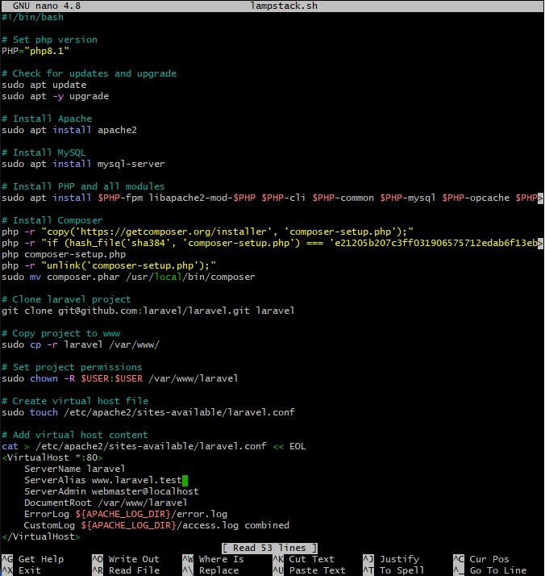

# Deploy LAMP Stack
<ul>
    <li>Created a file directory named Altproject using gitbash.</li>
    <li>created 2 VM named master and slave.</li>
    <li>provisioned the VM and configure the vagrantfile.</li>
    <li>On the master VM, I SSH into the machine.</li>
</ul>

 

<ul>
    <li>I created a bash script named lampstack.sh.</li>
    <li>typed nano lampstack.sh to edit the file.</li>
    <li>I typed the script to enable the deployment of LAMP stack and clone PHP application from https://github.com/laravel/laravel.git.</li>
    <li>Then i saved the script and exit from the file.</li>
</ul>

 

<ul>
    <li>I created an ansible playbook named playbook.yml.</li>
    <li>typed nano playbook.yml to edit the file.</li>
    <li>I typed the code to execute the bash script on the slave node and also verify that the PHP application is accessible through the VM IP address.</li>
    <li>I also create a cron job to check the server's uptime every 12am.</li>
    <li>Then i saved the file and exit from the file.</li>
</ul>

 

